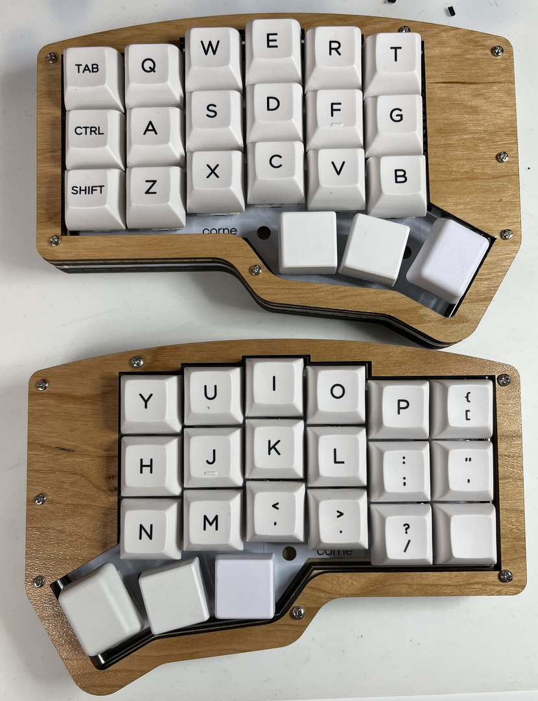
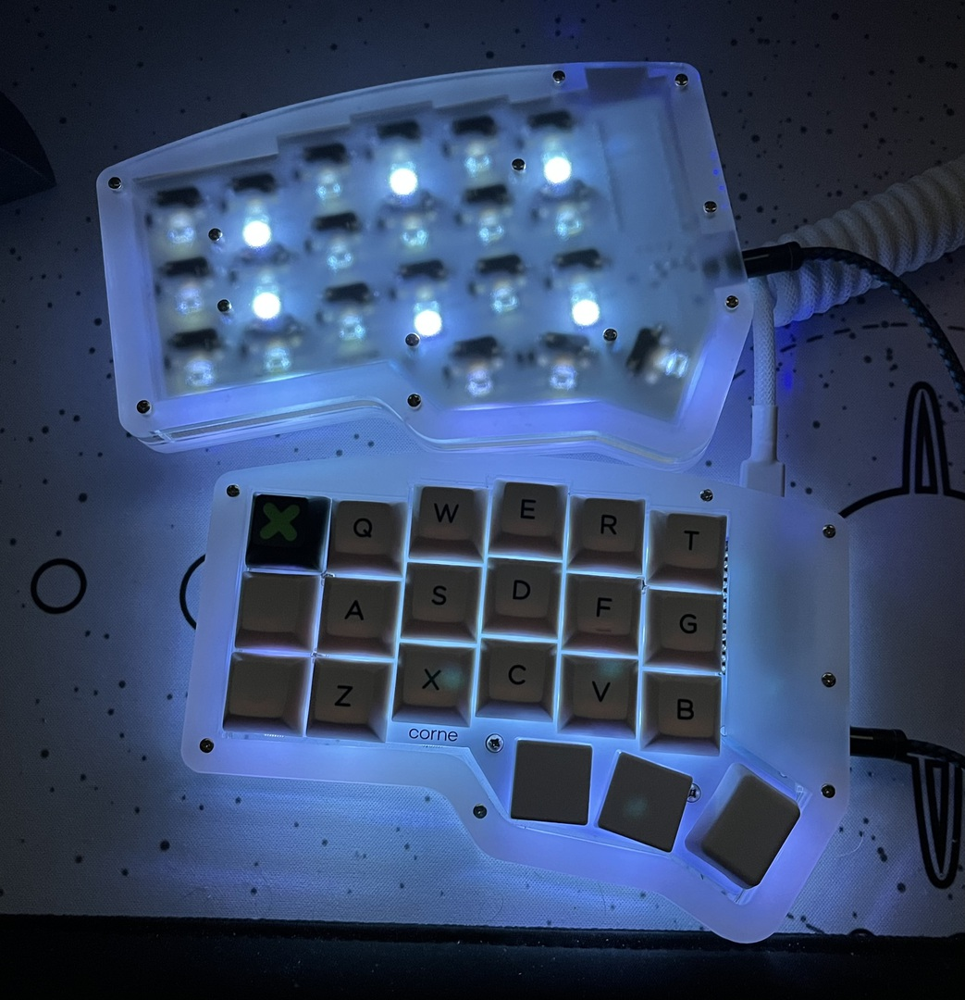

# crkbd-curvy-sandwich

Laser cut sandwich case for the Corne keyboard

More images are over in [the images/ directory](./images)

# Development

I use Shapr3d for all my CAD-ish work and the source for the DXFs lives there. `dxf/Core.dxf` is an export of that file. 

# Use

`dxf/All Parts.dxf` contains all the indivdual parts. When I cut my cases, I drag the `All Parts.dxf` file into the Glowforge site and pick out the pieces I need. I've successfully cut several cases using these files in MDF/Draftboard, acrylic, and various plywoods. 

The thickness of the parts is really dealer's choice. I print the top and bottom plates in 3mm, with two 6mm spacers. If using the key switch plate, that pretty much has to be in 1.5mm acrylic.

This is designed for round spacers. Hex spacers will not fit.

## Switch Plate

The key switch plate is totally optional. The bottom plate has holes that fit the screw placement for the FR4 switch plate that comes with many kits. If you're happy with that plate, remove your current bottom plate and screw your existing keyboard into the new base. This is the arrangement I prefer, honestly, because 1.5mm acrylic is very fragile. Typing on a 1.5mm acrylic platea is just fine for me but swapping switches is fraught with peril.

If you do use the plate, there are two choices, size wise.

If you're soldering on your switches, I recommend using 3mm whatever. Wood works really well here but it doesn't matter. The keys are very stable in this configuration.

If you're hotswapping, you probably want 1.5mm acrylic (aka 1/16"). Switches are built for 1.6mm FR4, typically, and they click right in and are stable. You can use 3mm and it will work just fine. Problem is that the keys have nothing to click into so you will always pull the switch out if you try and change the key cap. If that's cool with you, 3mm is very stable and doesn't have any concerns about breaking as you swap things around

# Original Versions

Forked from https://github.com/camrbuss/crkbd-curvy-sandwich

## What Did I Change?

I'm not going to keep this updated with every little change. But here's a list to start:

* The biggest change is that I got rid of the tiered structure.

* The original also has some weird alignment issues because the spacers are a different shape than everything else.

* Everything is generated from the same source now so all the walls and screw holes and what not line up perfectly.

* Walls are all the same size now.

* I realigned the screw holes and centered them in the wall wherever I could.

* I added another screw hole below the thumb key.

* I also cleaned up the files a lot in little ways. 

# License

- Copyright 2021 Cam Buss
- Copyright 2022 sungo

Made available under the terms of the MIT license. See the included LICENSE file
for details.
